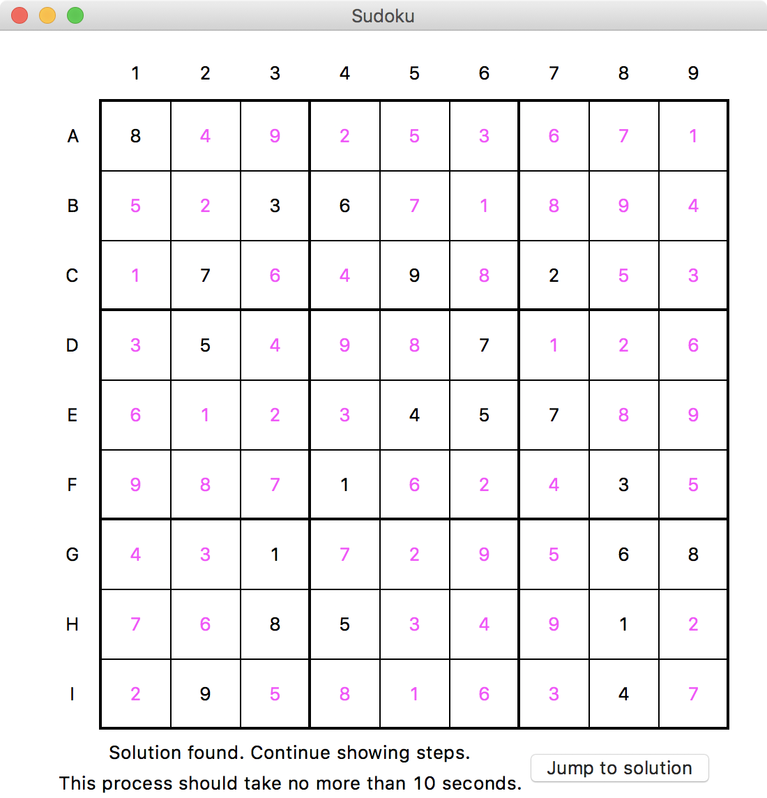
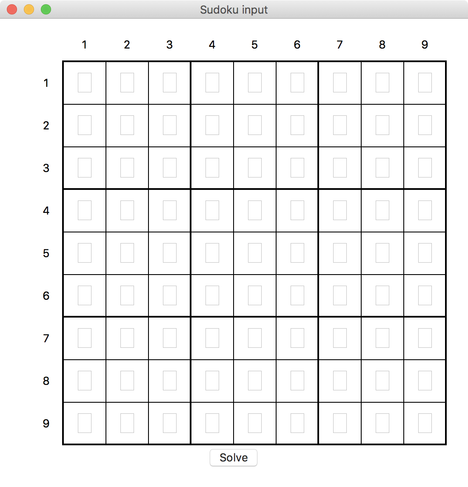

# Introduction
  Sudoku Solver is a project inspired by a class project of ColumbiaX - CSMM.101x (Artificial Intelligence). In this project, students were asked to find the solution of any solvable sudoku problems using a tree search algorithm – backtracking search. 

  On the top of a successfully finished project (my implementation took 7 seconds to solve the "world's hardest soduku problem," and 0.05s - 2s for regular sudoku problems), I implemented a GUI for it. Instead of entering a long string into console and read the output, users can input to and read the output from an actual soduku board. 




# Usage
To invoke the GUI input, simply do the following:
```sh
$ python3.6 Sudoku_Solver.py GUI
```
This will pop up a window like this. You can enter one digit (1-9) into each textbox or leave it blank.




Alternatively, you can give a flattened string as the representation of a board. For example, the input for this board 


([The World's Hardest Sudoku](http://www.conceptispuzzles.com/index.aspx?uri=info/article/424))

will be 
```sh
$ python3.6 Sudoku_Solver.py 800000000003600000070090200050007000000045700000100030001000068008500010090000400
```
This will print a string to STDOUT as the solution 

```
Solution: 812753649943682175675491283154237896369845721287169534521974368438526917796318452
```
